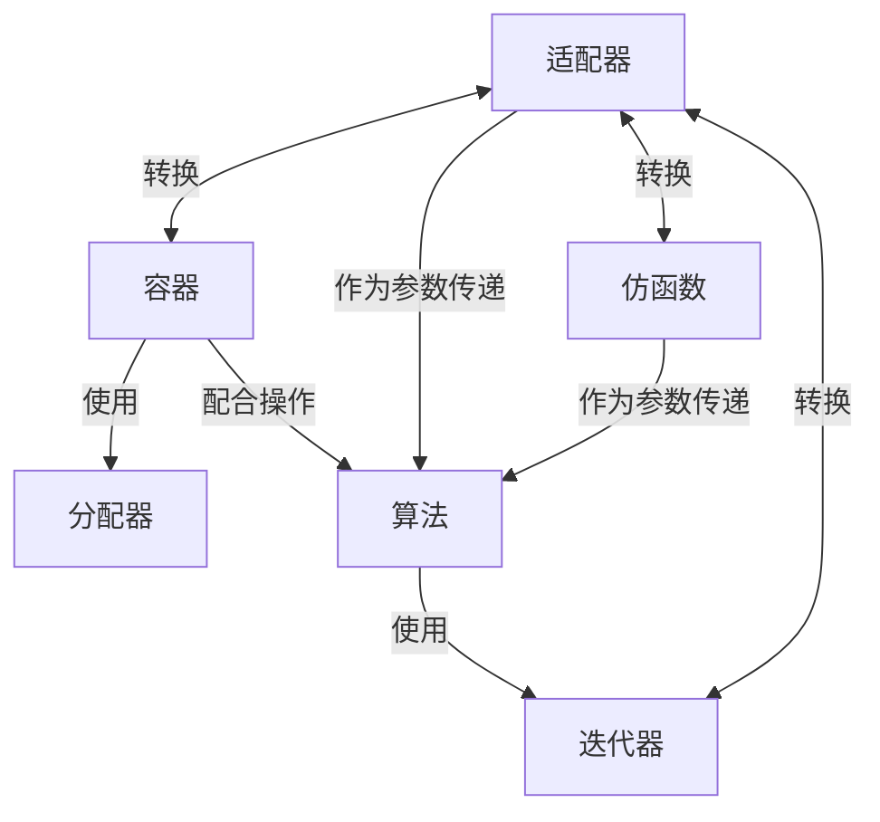

工作了一段时间，发现STL确实好用，因此打算写一个STL系列教程来介绍一下。

这是本系列教程的引言，介绍STL标准库。

---
# C++ 标准库（STL）概述

### 引言
C++标准库，即C++ Standard Library，是C++编程语言的核心组成部分之一，提供了大量的预定义函数、类和模板，以简化和加速软件开发过程。

本文将总体性的介绍一下STL库。

### STL六大部件
STL由六大关键部件组成，它们分别是容器、分配器、算法、迭代器、适配器和仿函数。

其中，容器和算法是核心部分，它们的结合可以高效地处理数据结构和执行操作。

#### 容器（Containers）

**容器**在C++标准库中扮演着存储和管理数据的角色。它们被设计为一系列数据结构的实现，旨在提供高效的数据访问和操作接口，同时隐藏了底层内存管理的细节。

序列式容器如`Array`、`Vector`、`List`、`Forward-List`、`Deque`等，主要用于存储有序的数据集合。
- **Array**: 对C++原始数组的封装，大小固定，不能动态扩展。
- **Vector**: 动态数组，可以根据需要自动扩展大小，通过内存复制来增加容量。
- **List**: 双向链表，提供快速的元素插入和删除操作。
- **Forward-List**: 单向链表，只支持从头部插入元素。
- **Deque**: 双向队列，两端均可进行元素的插入和删除。

关联式容器如`Set`、`Map`、`Multiset`、`Multimap`以及无序容器`Unordered Set`和`Unordered Map`，它们基于键值对进行数据存储，通常使用红黑树或哈希表实现高效查找。
- **Set**: 存储唯一元素的集合，通常使用红黑树实现，支持快速查找。
- **Map**: 键值对的集合，键必须是唯一的，也使用红黑树实现。
- **Multiset**: 类似set，但允许重复元素。
- **Multimap**: 类似map，但允许相同的键对应多个值。

#### 分配器（Allocator）

**分配器**是C++标准库中的一个重要概念，负责管理容器所需的内存资源。

分配器提供了一套统一的接口，用于内存的分配和释放，从而保证了容器在不同环境下的高效和一致行为。它允许用户自定义内存管理策略，同时提供默认实现。

#### 算法（Algorithms）

**算法**是C++标准库中另一大亮点，它包含了大量的数值和非数值算法，如排序、查找、修改等，可以应用于任何支持迭代器的容器。

算法的设计遵循了泛型编程的原则，通过模板技术实现了代码的重用和高效执行。

#### 迭代器（Iterator）

**迭代器**在C++标准库中充当了算法和容器之间的纽带。它提供了一种通用的机制，用于访问容器中的元素，而无需暴露容器的具体实现细节。

迭代器支持类似指针的操作，使得算法可以在不同的容器类型上无缝操作。

#### 适配器（Adapters）

**适配器**在C++标准库中用于扩展或改变容器、迭代器和仿函数的行为。适配器可以将一种容器转换为另一种形式，或者改变迭代器的遍历方向，还可以修改仿函数的行为，比如反转比较操作的结果。

典型的适配器是队列和栈：
- **Stack**: 后进先出（LIFO）的容器适配器，通常基于vector或deque实现。
- **Queue**: 先进先出（FIFO）的容器适配器，同样通常基于vector或deque实现。

#### 仿函数（Functors）

**仿函数**是通过重载函数调用运算符`operator()`的类，它们可以像函数一样被调用，但同时可以携带状态和数据。这使得仿函数在执行任务时可以保持上下文信息，增加了编程的灵活性和表达力。例如，可以创建一个带有状态的仿函数，用于实现复杂的搜索或过滤逻辑。

### 六大组件的关系

C++标准库中的六大组件相互协作，共同构成了一个强大而灵活的编程框架。

六大组件常见的关系如下：

- 分配器与容器：虽然分配器通常是透明的，但它在容器的内部用于管理内存，确保容器能够有效地扩展和收缩。

- 容器与迭代器：容器提供了迭代器，迭代器允许算法访问容器中的元素。
  例如，vector<int>::iterator是vector<int>的迭代器类型。

- 适配器与容器、仿函数和迭代器：适配器可以修改容器、仿函数或迭代器的行为，使其适应不同的使用场景。
  例如，std::reverse_iterator可以将迭代器的方向反转，而std::bind2nd可以将仿函数的一个参数绑定为常数。

- 算法与迭代器：算法通过迭代器来操作容器中的数据。
  例如，std::sort可以接受两个迭代器参数，分别指向容器的开始和结束。

- 算法与仿函数：算法可以接受仿函数作为参数，以定制算法的行为。
  例如，std::sort可以接受一个比较仿函数来定义排序的顺序。
...

六大组件在C++标准库中常见的关系图如下：

通过合理利用容器、算法、迭代器等工具，可以高效地解决复杂的数据处理和算法实现问题，同时保证代码的可读性和可维护性。

接下来我们会一一介绍这些组件，敬请期待！

