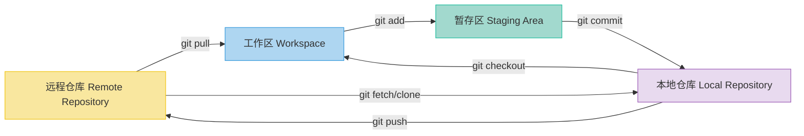
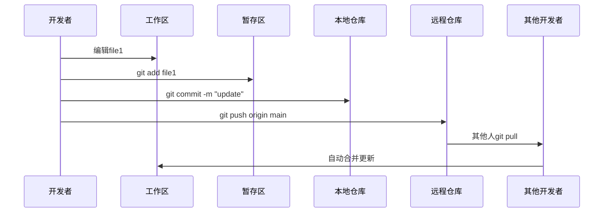

最近要在团队里带新人了，写一个简单使用 Git 的教程方便做培训。

---

### Git简介

Git是目前应用最普遍的分布式版本控制系统，主要优势包括：

- **版本控制**：完整记录历史变更，可回退任意版本
- **团队协作**：支持多人并行开发，高效合并代码
- **工作组织**：通过分支体系管理不同功能开发
- **代码质量**：通过代码评审保障项目质量
- **数据安全**：远程仓库备份，防止工作丢失


### 四大工作区域
1. **工作区(Workspace)**：本地编辑器直接修改的文件
2. **暂存区(Staging Area)**：`git add`后的临时存储区域
3. **本地仓库(Local Repository)**：`git commit`后的版本库
4. **远程仓库(Remote Repository)**：`git push`后的共享代码库




### 核心工作流




### 常用命令


#### 仓库初始化与克隆

``` bash
# 初始化新仓库（新建项目时使用）
git init

# 克隆远程仓库（下载已有项目）
git clone <repository_url>
```

#### 分支管理

``` bash
# 创建并切换到新分支
git checkout -b <new_branch_name>

# 查看所有分支（本地+远程）
git branch -a

# 切换现有分支
git checkout <existing_branch_name>

# 将本地分支推送到远程
git push origin <branch_name>

# 删除本地分支（安全方式）
git branch -d <branch_name>

# 强制删除本地分支
git branch -D <branch_name>

# 删除远程分支
git push origin --delete <branch_name>
``` 


#### 代码提交流程

``` bash
# 添加文件到暂存区
git add <file_name>    # 添加单个文件
git add .              # 添加所有修改

# 提交到本地仓库（必须添加提交信息）
git commit -m "清晰的修改说明"

# 推送到远程仓库
git push
git push origin <branch_name>
```


#### 同步与合并

``` bash
# 获取远程最新代码（不自动合并）
git fetch

# 拉取并合并当前分支（fetch + merge）
git pull
git pull origin <branch_name>

# 合并指定分支到当前分支
git merge <source_branch_name>
``` 


#### 查看命令

``` bash
# 查看当前状态（最常用命令）
git status

# 查看提交历史（按Q退出）
git log

# 查看工作区与暂存区差异
git diff

# 查看特定文件差异
git diff <file_name>
``` 

### 配置 .gitignore

`.gitignore` 在Git版本控制中十分重要，它可以​让Git自动跳过指定文件/目录，避免将无关内容（如临时文件、编译产物、敏感配置等）误提交到版本库。


#### 文件位置配置

| 类型         | 文件路径                | 作用范围     | 是否提交 | 配置命令                              |
|--------------|-------------------------|--------------|----------|---------------------------------------|
| 项目级       | `/.gitignore`           | 当前项目     | 是       | 手动创建                              |
| 子目录级     | `/subdir/.gitignore`    | 指定子目录   | 是       | 手动创建                              |
| 全局级(不推荐) | `~/.gitignore_global`   | 所有项目     | 否       | `git config --global core.excludesfile ~/.gitignore_global` |
| 仓库本地级(不推荐)   | `/.git/info/exclude`    | 当前仓库     | 否       | 手动创建                              |

注意子目录.gitignore会覆盖父目录规则。


#### 核心匹配规则

| 模式          | 示例                | 匹配目标                     | 说明                          |
|---------------|---------------------|------------------------------|-------------------------------|
| 精确匹配      | `config.ini`        | 同名文件                     | 区分大小写                    |
| `*.ext`       | `*.log`             | 指定扩展名                   | 匹配所有子目录                |
| `dir/`        | `node_modules/`     | 整个目录                     | 斜杠结尾                      |
| `/file`       | `/debug.log`        | 仅根目录下文件               | 不匹配子目录                  |
| `!`例外       | `!important.log`    | 排除特定文件                 | 必须放在忽略规则后            |
| `#`注释       | `# 系统文件`        | 无效果                       | 解释性文字                    |
| `?`通配符     | `file?.txt`         | file1.txt/fileA.txt等        | 匹配单个字符                  |
| `[abc]`       | `temp[0-9].log`     | temp0.log到temp9.log         | 字符范围匹配                  |
| `**/`递归     | `**/build/`        | 所有层级build目录            | 匹配任意深度子目录            |


#### 常用忽略模板

```gitignore
# ---------- 系统文件 ----------
.DS_Store
Thumbs.db
Desktop.ini

# ---------- 开发环境 ----------
.idea/
.vscode/
*.swp
*.swo

# ---------- 依赖项 ----------
node_modules/
lib/

# ---------- 构建产物 ----------
dist/
build/
*.exe
*.dll

# ---------- 日志文件 ----------
*.log

# ---------- 环境配置 ----------
.env
.env.local

```

---
现在可以开始练习使用 Git 了。