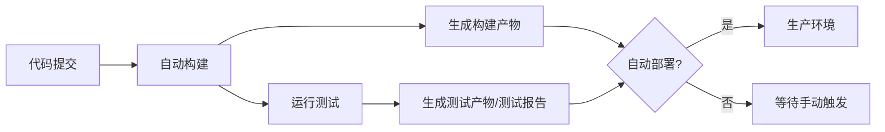
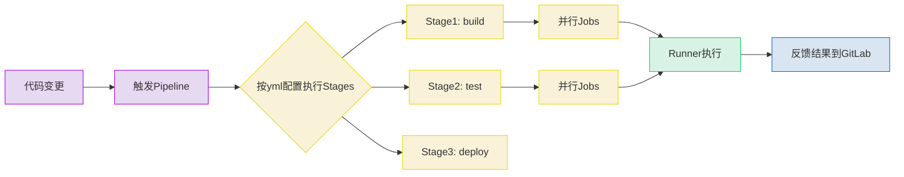

最近要在团队里带新人了，写一个简单使用 GitLab CI/CD 的教程方便做培训。

---

### CI/CD 简单介绍

CI/CD 是一套自动化的开发流程，用自动化实现快速、安全的软件交付。
CI/CD 通过自动化将开发、测试、部署流程串联，实现 ​​“快速迭代、高质量交付”​​。

其核心思想在于：

- ​快速反馈​：​	开发者提交代码后立即获知构建/测试结果，缩短问题修复周期。
- 降低风险​：​	小批量频繁集成减少“大爆炸式”合并冲突，部署回滚更简单。
- ​提高效率​：​	自动化代替手动操作（如编译、测试、部署），释放人力专注开发。
- ​标准化流程：​​	通过配置文件（如.gitlab-ci.yml）统一团队开发规范，避免环境差异问题。
- ​可追溯性​：​	完整记录每次构建、测试、部署的日志和状态，便于审计和故障排查。

#### CI（持续集成，Continuous Integration）​​

开发者频繁将代码变更合并到共享主干（如每天多次），每次提交后自动触发构建和测试。
其​核心​是通过自动化快速发现集成错误，确保代码质量。

​典型流程​​：代码提交 → 自动构建 → 运行单元测试 → 生成报告。


#### ​CD（持续交付/部署，Continuous Delivery/Deployment）​
根据部署阶段是否需要人工审批，CD可分为两种：
​持续交付​​：代码通过CI后，自动打包为可发布的版本，但需手动触发部署。
​持续部署​​：在持续交付基础上，自动部署到生产环境（无需人工干预）。

#### CI/CD 流程图


### 基础概念

#### Pipeline（流水线）
- 一次完整的 CI/CD 流程，包含多个阶段（如构建、测试、部署）。
- 触发条件：代码推送（Push/Merge）或手动触发。

#### Stages（阶段）
- 逻辑分组，按顺序执行（例如 `build` -> `test` -> `deploy`）。
- 同一阶段的 Jobs 并行执行。

#### Jobs（任务）
- 具体执行单元，需定义：
```yaml
  job_name:
    stage: test       # 所属阶段
    script: npm test  # 执行的命令
    image: node:16    # 使用的 Docker 镜像
```

#### ​Runner（执行器）
- 执行 Job 的代理程序，支持：
  - ​共享 Runner​​（GitLab 提供）
  - ​私有 Runner​​（自托管，更灵活）

#### CI/CD实现过程图

GitLab 实现CI/CD的过程如下图，当git提交到远程仓库时，GitLab 会根据 `.gitlab-ci.yml` 的配置生成 jobs 任务，再下发给 runner 执行，当 runner 执行完后收集相关信息。




### 典型工作流程

- ​​代码推送​：​触发 Pipeline。
- ​阶段执行​​：​
   - Build​​: 编译代码，生成制品。
   - ​Test​​: 运行单元/集成测试。
   - ​​Deploy​​: 部署到指定环境。
- ​结果反馈​​：通过 GitLab 界面查看日志和状态


#### 配置文件
以下为配置文件 `.gitlab-ci.yml` 示例：

```yaml
variables:
  APP_NAME: "myapp"          # 应用名称变量
  BUILD_DIR: "build"         # 构建目录
  DEPLOY_TARGET: "/usr/local/bin"  # 默认部署目标路径

stages:
  - build
  - test
  - deploy

# 构建阶段
build:
  stage: build
  script:
    - mkdir -p ${BUILD_DIR} && cd ${BUILD_DIR}
    - cmake -DCMAKE_BUILD_TYPE=Release ..
    - make
  artifacts:
    paths:
      - ${BUILD_DIR}/${APP_NAME}  # 保存可执行文件
    expire_in: 1 hour             # 临时存储

# 测试阶段
test:
  stage: test
  dependencies:
    - build  # 依赖构建产物
  script:
    - cd ${BUILD_DIR} && ctest

# 部署阶段
deploy:
  stage: deploy
  variables:
    DEPLOY_ENV: "production"  # 覆盖部署环境变量
  script:
    - echo "正在部署 ${APP_NAME} 到 ${DEPLOY_ENV} 环境"
    - scp ${BUILD_DIR}/${APP_NAME} user@server:${DEPLOY_TARGET}
  environment:
    name: $DEPLOY_ENV
    url: https://${DEPLOY_ENV}.example.com
  rules:
    - if: $CI_COMMIT_TAG  # 仅当打标签时触发
      when: manual        # 需要手动确认
```
#### runner
runner 在 GitLab 和编译测试机中部署，可由管理员设置添加。

runner 配置流程按照 GitLab 的建议配置即可。

---
现在可以开始使用 GitLab 的 CI/CD 协助开发了。